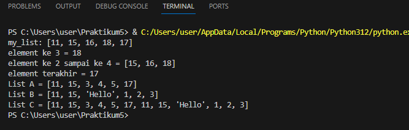
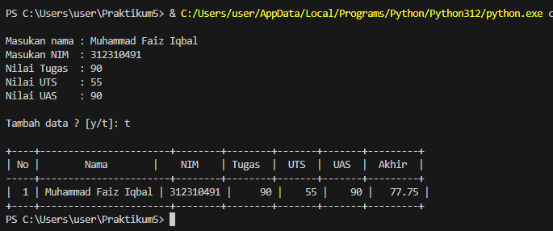

# Praktikum_5
## command 
 - git add dapat digunakan secara spesifik untuk file tertentu atau direktori, memberikan Anda fleksibilitas untuk memilih perubahan mana yang akan dimasukkan dalam staging 
  area.
 - git commit -m “hi” Untuk menyimpan perubahan yang ada kedalam database repository local
 - git remote add origin https://github.com/faiziqbal1201/Praktikum_5.git Remote Repository merupakan repository server yang akan digunakan untuk menyimpan setiap perubahan pada 
   local repository, sehingga dapat diakses oleh banyak user.
 - git push -u origin master/main Untuk mengirim perubahan pada local repository ke server gunakan perintah git push.
 - git clone [url] Clone repository, pada dasarnya adalah meng-copy repository server dan secara otomatis membuat satu direktory sesuai dengan nama repositorynya (working 
   directory).
``````python
## akses list:
• tampilkan elemen ke 3
• ambil nilai elemen ke 2 sampai elemen ke 4
• ambil elemen terakhir
## ubah elemen list:
• ubah elemen ke 4 dengan nilai lainnya
• ubah elemen ke 4 sampai dengan elemen terakhir
## tambah elemen list:
• ambil 2 bagian dari list pertama (A) dan jadikan list ke 2 (B)
• tambah list B dengan nilai string
• tambah list B dengan 3 nilai
• gabungkan list B dengan list A

# Buat sebuah list sebanyak 5 elemen dengan nilai bebas
my_list_a =[11, 15, 16, 18, 17]
print("my_list:", my_list_a)

# akses list
print("element ke 3 =", my_list_a[3])
print("element ke 2 sampai ke 4 =", my_list_a[1:4])
print("element terakhir =",my_list_a[-1])

# ubah elemen list
my_list_a[2] = 3
my_list_a[3:4] = [4, 5]

# tambah elemen list
my_list_b = my_list_a[0:2]
my_list_b.append("Hello")
my_list_b.extend([1, 2, 3])
my_list_c = my_list_a + my_list_b

print("List A =", my_list_a)
print("List B =", my_list_b)
print("List C =", my_list_c)
``````


## PRAKTIKUM 4
- Code ini adalah program sederhana dalam bahasa Python yang memanfaatkan pustaka Tabulate untuk mengumpulkan data nilai mahasiswa dan menampilkan hasilnya dalam bentuk 
  tabel. Program berjalan dalam perulangan dimana pengguna diminta untuk memasukkan data mahasiswa, termasuk nama, NIM (Nomor Induk Mahasiswa), nilai tugas, nilai UTS, dan 
  nilai UAS. Setelah data dimasukkan, nilai akhir dihitung berdasarkan bobot tertentu dan disimpan dalam bentuk dictionary. Pengaturan tata letak tabel, termasuk penataan 
  angka dan teks, diatur menggunakan parameter numalign dan stralign.
- OUTPUT
``````python
# LIST
nama = []
nim = []
nilaiTugas = []
nilaiUTS = []
nilaiUAS = []
nilaiAkhir = []

print()

# Input
while True:
    nama.append(input("Masukan nama : "))
    nim.append(input("Masukan NIM  : "))
    Tugas = int(input("Nilai Tugas  : ")); 
    nilaiTugas.append(Tugas)
    UTS   = int(input("Nilai UTS    : ")); 
    nilaiUTS.append(UTS)
    UAS   = int(input("Nilai UAS    : ")); 
    nilaiUAS.append(UAS)

    nilaiAkhir.append(Tugas * 30/100 + UTS * 35/100 + UAS * 35/100)

    print()
    _tanya = input("Tambah data ? [y/t]: ")
    print()
    if(_tanya == "t"):
        break
# Output
print("+----+-----------------------+--------+--------+-------+-------+---------+")
print("| {0:^2} | {1:^18} | {2:^9} | {3:^6} | {4:^5} | {5:^5} | {6:^7} |".format("No", "Nama", "NIM", "Tugas", "UTS", "UAS", "Akhir"))
print("-----+-----------------------+--------+--------+-------+-------+---------+")

no = 0
for nama, nim, Tugas, UTS, UAS, nilaiAkhir in zip(nama, nim, nilaiTugas, nilaiUTS, nilaiUAS, nilaiAkhir):
    no += 1    
    print("| {0:>2} | {1:<18} | {2:>8} | {3:>6} | {4:>5} | {5:>5} | {6:>7} |".format(no, nama, nim, Tugas, UTS, UAS, nilaiAkhir))
print("+----+-----------------------+--------+--------+-------+-------+---------+")
``````
